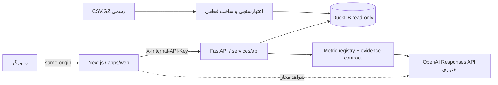

# نبض زرین

«نبض زرین» یک محصول تحلیلی فارسی و راست‌به‌چپ برای چالش داده زرین‌پال است. محصول ابتدا شاخص‌ها و پیشنهادها را به‌صورت قطعی در DuckDB محاسبه می‌کند و سپس، در صورت وجود کلید OpenAI، آن‌ها را با یک تحلیل‌گر هوشمند توضیح می‌دهد. مدل زبانی منبع حقیقت نیست و فقط شواهد اعتبارسنجی‌شده را شرح می‌دهد.

## قابلیت‌ها

- **مرکز اقدام:** سه اقدام اولویت‌دار با محرک عددی، سازوکار مورد انتظار، قدرت شواهد و برنامه سنجش.
- **رشد و فرصت‌ها:** تجزیه درآمد تأییدشده، رفتار مشاهده‌شده کارت‌های تکراری، بازه مبلغ، همتایان و سناریوی فرصت.
- **پایداری پرداخت:** مسیر Created → Attempted → InBank → Paid → Verified، عدم تأیید پس از پرداخت، بازیابی با تلاش مجدد، کدهای PSP و تأخیر API.
- **شواهد و تحلیل‌گر:** تعریف و فرمول شاخص، دامنه داده، مقایسه، ردیف‌های مجاز همان پذیرنده، محدودیت‌ها و پاسخ هوشمند منبع‌دار.
- تجربه واکنش‌گرا با ناوبری کناری دسکتاپ، ناوبری پایین موبایل، فیلتر موبایلی و نمایش تمام‌صفحه شواهد.

## معماری



مرورگر هیچ‌گاه مستقیماً به API تحلیلی یا کلید OpenAI دسترسی ندارد. Route Handlerهای Next.js درخواست‌های تحلیلی را با راز داخلی به FastAPI می‌فرستند. هر ادعای عددی رابط کاربری یک `metric_id` و `insight_id` پایدار دارد و از همان محاسبه‌ای ساخته می‌شود که مقدار نمایش‌داده‌شده را تولید کرده است.

## پیش‌نیازها

- Node.js 22 یا جدیدتر و Corepack
- Python 3.12
- برای اجرای کانتینری: Docker Desktop یا Docker Engine به همراه Compose

Docker روی محیط اولیه توسعه این پروژه نصب نبود؛ بنابراین اجرای محلی کانتینر تنها پس از نصب Docker ممکن است. CI هر دو Dockerfile را می‌سازد؛ تصویر API در CI نیز با SHA-256 رسمی pin‌شده، `ALLOW_DEMO_FALLBACK=false` و DuckDB کامل و immutable ساخته می‌شود.

## راه‌اندازی محلی

1. تنظیمات نمونه را کپی کنید و رازها را تغییر دهید:

   ```powershell
   Copy-Item .env.example .env
   ```

2. وابستگی‌های وب و API را نصب کنید:

   ```powershell
   corepack enable
   pnpm install
   py -3.12 -m venv .venv
   .\.venv\Scripts\Activate.ps1
   python -m pip install --requirement services/api/requirements-dev.txt
   ```

3. تنظیم پیش‌فرض `.env.example` منبع **رسمی و کامل** است: `DATASET_PATH` خالی، URL رسمی و SHA-256 برابر با `84ac8a28df48ca7baeaf0b1cec563a3f0a3516039f5f62e9bfd11124ca35b461`. فایل pin‌شده `61,282,974` بایت دارد و به `2,213,289` تلاش، `2,062,839` نشست، `396,374` مشتری درون‌پذیرنده و `343` پذیرنده در بازه `2026-01-01` تا `2026-06-30` materialize شده است. validator هیچ خطا یا ناسازگاری نشست پیدا نکرد و manifest مقدار `partial_data=false` دارد.

   برای بازتولید مستقل دانلود و هش:

   ```powershell
   $officialUrl = "https://startech.s3.ir-thr-at1.arvanstorage.ir/other%2Fchallenge_data.csv.gz?versionId="
   $officialSha = "84ac8a28df48ca7baeaf0b1cec563a3f0a3516039f5f62e9bfd11124ca35b461"
   Invoke-WebRequest -Uri $officialUrl -OutFile .\challenge_data.csv.gz
   if ((Get-FileHash .\challenge_data.csv.gz -Algorithm SHA256).Hash.ToLowerInvariant() -ne $officialSha) { throw "Dataset checksum mismatch" }
   ```

   سپس قرارداد داده را روی CSV.GZ رسمی اجرا و گزارش JSON را نگه دارید. برای ساخت صریح DuckDB نیز از همان فایل اعتبارسنجی‌شده استفاده کنید:

   ```powershell
   python zarinpal-agent-skills/.agents/skills/zarinpal-data-contract/scripts/validate_dataset.py .\challenge_data.csv.gz --json-output .\artifacts\data-validation.json --fail-on-errors
   $env:DATASET_SHA256="84ac8a28df48ca7baeaf0b1cec563a3f0a3516039f5f62e9bfd11124ca35b461"
   Push-Location services/api
   python -m app.bootstrap --source ..\..\challenge_data.csv.gz --database .data\analytics.duckdb --json-output ..\..\artifacts\build-manifest.json
   Pop-Location
   ```

   **جایگزین محلی و جزئی:** برای استفاده از فایل تعمیرشده XLSX، در `.env` مقدار `DATASET_PATH=challenge_data_cleaned.xlsx` و `DATASET_SHA256=34b265c9d9c9fd865a838ed017fd7d62625f6d41ae23bfe7cca59e6a36d82693` را با هم قرار دهید. این فایل دقیقاً `1,048,575` ردیف داده، یعنی سقف Excel پس از header، دارد؛ بنابراین `partial_data=true` است و کامل‌بودن کل دیتاست را اثبات نمی‌کند. هر مسیر محلی غیرخالی بر URL رسمی اولویت دارد. اگر workbook محلی را در ریشه نگه داشته‌اید و می‌خواهید اجرای محلی را حتماً روی داده کامل انجام دهید، CSV.GZ رسمی دانلودشده را صریحاً در `DATASET_PATH` قرار دهید.

4. هر دو سرویس را اجرا کنید:

   ```powershell
   pnpm dev
   ```

   وب در `http://localhost:3000`، API در `http://localhost:8000` و سلامت عمومی API در `http://localhost:8000/healthz` در دسترس است.

برای اجرای جداگانه:

```powershell
pnpm dev:api
pnpm dev:web
```

### اجرای Docker Compose

Compose به‌طور پیش‌فرض تصویر کامل را با SHA رسمی pin‌شده و بدون fallback می‌سازد. فرمان صریح این حالت نیز چنین است؛ خطای دانلود یا mismatch عمداً build را متوقف می‌کند:

```powershell
$env:ALLOW_DEMO_FALLBACK="false"
$env:DATASET_SHA256="84ac8a28df48ca7baeaf0b1cec563a3f0a3516039f5f62e9bfd11124ca35b461"
docker compose up --build
```

برای رابط و تست محلی می‌توان دموی کالیبره‌شده را عمداً و مستقیماً ساخت؛ این حالت ابتدا دانلود رسمی را امتحان نمی‌کند:

```powershell
$env:ALLOW_DEMO_FALLBACK="true"
docker compose up --build
```

این دو حالت به‌صورت پنهانی به یکدیگر تبدیل نمی‌شوند. دموی Compose فقط برای توسعه رابط و تست است؛ خروجی مسابقه و استقرار واقعی از CSV.GZ رسمی و `partial_data=false` استفاده می‌کند.

## کنترل کیفیت

```powershell
# واحد و یکپارچه
pnpm lint
pnpm typecheck
pnpm test:web
pnpm test:api

# قرارداد OpenAPI تولیدشده
pnpm api:types:check

# validatorهای skill روی Linux و Windows در CI
python scripts/test_skill_validators.py

# E2E واقعی: FastAPI + Next.js، بدون mock کردن سرویس‌های خود پروژه
pnpm e2e:install
$env:USE_DEMO_DATA="true"
pnpm e2e
```

برای آزمودن خروجی standalone همان مسیری که Docker و CI اجرا می‌کنند:

```powershell
pnpm build
# آماده‌سازی مستقل artifact؛ start:standalone نیز همین مرحله را خودکار اجرا می‌کند.
pnpm --dir apps/web prepare:standalone
pnpm --dir apps/web start:standalone
```

Playwright مسیرهای اصلی را در 1440×900 و 390×844 آزمایش می‌کند و سرریز افقی را در عرض‌های 320، 360، 768، 1024، 1366 و 1920 پیکسل می‌سنجد. تست‌ها RTL، زوم ۲۰۰٪، `prefers-reduced-motion`، پنل شواهد و خطاهای جدی/بحرانی WCAG را نیز پوشش می‌دهند. در CI دو بار retry، trace در اولین retry، تصویر و ویدئو فقط هنگام شکست، و گزارش HTML/JUnit فعال است.

## قرارداد داده و محدودیت‌ها

- هر ردیف منبع یک **تلاش پرداخت** است؛ درآمد، تعداد پرداخت و مبلغ متوسط فقط از یک ردیف معتبر به‌ازای هر `session_key` محاسبه می‌شود.
- `try_seq = 0` یعنی هیچ تلاش پرداختی ثبت نشده و وارد مخرج تحلیل PSP، پاسخ سوئیچ یا تأخیر نمی‌شود.
- موفقیت نهایی فقط `Verified` است. `Paid` یعنی کارت کسر شده ولی پذیرنده پرداخت را تأیید نکرده است؛ سایر وضعیت‌ها به‌طور کلی «خطای بانک» نامیده نمی‌شوند.
- `payer_card_key` فقط درون یک پذیرنده یکتا است. کلید مشتری `(merchant_key, payer_card_key)` است و هیچ کارت یا شخصی میان پذیرندگان ردیابی نمی‌شود.
- کد پاسخ فقط در محدوده `psp_code` مقایسه می‌شود. چون codebook رسمی وجود ندارد، نام‌هایی مانند «موجودی ناکافی» به کدها نسبت داده نمی‌شود.
- تهی‌بودن داده می‌تواند ساختاری و وابسته به مرحله چرخه پرداخت باشد؛ پیش از حذف یا جای‌گذاری، به تفکیک وضعیت پروفایل می‌شود.
- `init_time_ms` و `verify_time_ms` زمان API درگاه هستند، نه زمان فکر یا تعامل خریدار.
- همه مبالغ **ریال ایران (IRR)** هستند.
- متن اجباری `adjusted_fee`: **Adjusted fee is a uniformly transformed analytical value and does not represent ZarinPal's actual tariff.** در رابط فارسی نیز روشن می‌شود که این مقدار هزینه واقعی زرین‌پال نیست و فقط مقایسه نسبی آن معتبر است.
- سناریوی فرصت یک محاسبه «اگر-آنگاه» است، نه پیش‌بینی یا تضمین اثر. روابط مشاهده‌ای نیز علّی معرفی نمی‌شوند.

## ردیابی و بازتولید عددها

هر KPI، یادداشت نمودار، هشدار و پیشنهاد باید از یک evidence object معتبر ساخته شود. کنترل «چگونه محاسبه شد؟» موارد زیر را نشان می‌دهد:

- تعریف، فرمول، دانه‌بندی اصلی، صورت و مخرج؛
- فیلتر، استثنا، سیاست null، تاریخ و منطقه زمانی `Asia/Tehran`؛
- حجم نمونه، مبنای مقایسه، وزن‌دهی و حداقل نمونه؛
- ستون‌های منبع، نسخه محاسبه و مرجع بازتولید؛
- محدودیت‌ها و، برای پیشنهادها، اقدام و برنامه اندازه‌گیری.

APIهای اصلی:

```text
GET  /healthz
GET  /api/v1/merchants
GET  /api/v1/dashboard?merchant_key=&from=&to=
GET  /api/v1/insights/{insight_id}/evidence
GET  /api/v1/insights/{insight_id}/records?page=&page_size=
POST /api/chat                         # same-origin Next.js route
```

به‌جز `/healthz`، مسیرهای FastAPI در محیطی که `INTERNAL_API_KEY` تنظیم شده فقط با `X-Internal-API-Key` پاسخ می‌دهند. evidence همتایان فقط aggregate است و ردیف خام سایر پذیرندگان به مرورگر یا مدل داده نمی‌شود.

## استقرار روی Render

فایل `render.yaml` برای استقرار مسابقه دو Docker Web Service روی پلن پولی **Starter** می‌سازد. پیش از ایجاد Blueprint، هزینه روز Render را بررسی کنید؛ برای آزمایش کم‌هزینه‌تر می‌توان `plan` را موقتاً به `free` تغییر داد، با پذیرش cold start و منابع کمتر. سرویس وب از شبکه خصوصی Render به `API_HOSTPORT` متصل می‌شود و همان راز تولیدشده API را از `envVarKey` دریافت می‌کند. Blueprint، URL رسمی، SHA-256 معتبر و `ALLOW_DEMO_FALLBACK=false` را از قبل pin کرده است. پس از sync:

1. در صورت نیاز `OPENAI_API_KEY` را وارد کنید یا خالی بگذارید تا پاسخ قطعی fallback فعال باشد؛
2. بدنه پاسخ API در `/healthz` را بررسی کنید و مطمئن شوید `status=ok`، `database_ready=true`، `checksum_status=verified`، `partial_data=false` و `source_kind` منبع رسمی است. مسیر وب `/api/health` فقط برای بالادست در دسترس و DuckDB آماده HTTP 200 می‌دهد و در قطع API یا آماده‌نبودن DB مقدار 503 برمی‌گرداند؛ بااین‌حال حالت نمونهٔ جزئی نیز می‌تواند آمادهٔ سرویس و `status=degraded` باشد، پس برای تأیید دادهٔ کامل همچنان بدنهٔ `/healthz` مرجع است؛
3. smoke test دسکتاپ و موبایل را با دستور سازگار با PowerShell روی URL عمومی اجرا کنید:

   ```powershell
   $env:BASE_URL="https://your-web-service.onrender.com"
   pnpm e2e
   Remove-Item Env:BASE_URL
   ```

مرجع: [Render Blueprint specification](https://render.com/docs/blueprint-spec)، [Render Docker services](https://render.com/docs/docker) و [Next.js self-hosting](https://nextjs.org/docs/app/guides/self-hosting).

## سناریوی ویدئوی تحویل — ۴:۵۰

| زمان | نمایش اجباری |
| --- | --- |
| 00:00–00:20 | معرفی تصمیم تجاری، انتخاب M43، بازه تاریخ و توضیح کوتاه دانه‌بندی session/attempt و IRR. |
| 00:20–01:20 | دسکتاپ: مرکز اقدام، سه پیشنهاد عددی، تغییر درآمد، تجزیه عوامل و نوار چرخه پرداخت. |
| 01:20–02:05 | دسکتاپ: رشد و پایداری؛ تکرار مشاهده‌شده، گروه همتا، سناریوی فرصت، Paid بدون Verified، retry، PSP و تأخیر API. |
| 02:05–02:45 | دسکتاپ: «چگونه محاسبه شد؟»، فرمول/صورت/مخرج/محدودیت، ردیف‌های خود M43 و بازتولید مقدار. سپس یک پرسش AI با منبع و fallback بدون کلید. |
| 02:45–03:55 | موبایل 390px: هر چهار مقصد، ناوبری پایین، فیلتر bottom sheet، نمودار و جدول جایگزین، کارت ردیف‌ها، پنل تمام‌صفحه شواهد و تحلیل‌گر با صفحه‌کلید باز. |
| 03:55–04:25 | اجرای validator و تست reconciliation؛ نشان‌دادن registry/evidence و اینکه `adjusted_fee` تعرفه واقعی نیست و کد PSP معنی‌گذاری نشده است. |
| 04:25–04:50 | README، اجرای `pnpm dev`/Docker، CI سبز، لینک GitHub و URL Render. |

ویدئو باید همه قابلیت‌ها را روی **هر دو** دستگاه موبایل و دسکتاپ نشان دهد؛ جدول بالا ترتیب فشرده‌ای است و سقف پنج دقیقه را با حاشیه ده ثانیه رعایت می‌کند.

## ساختار مخزن

```text
apps/web/            Next.js, shadcn/ui, ECharts, AI Elements
services/api/        FastAPI, DuckDB, pipeline, metric/evidence contracts
tests/e2e/           Playwright desktop/mobile/accessibility
.github/workflows/   CI با Actionهای pin‌شده به commit SHA
compose.yaml         اجرای محلی دو سرویس
render.yaml          استقرار دو سرویس روی Render
```

مجوز داده و شرایط استفاده از دیتاست تابع قوانین چالش زرین‌پال است. هیچ شناسه مستعاری نباید برای شناسایی فرد، پذیرنده، بانک یا ترمینال واقعی استفاده شود.
