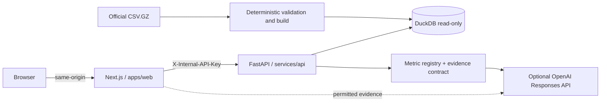

# Zarin Pulse

“Zarin Pulse” is a Persian, right-to-left analytical product for the ZarinPal data challenge. The product first calculates metrics and recommendations deterministically in DuckDB and then, when an OpenAI key is available, explains them through an intelligent analyst. The language model is not the source of truth and only describes validated evidence.

## Features

- **Action Center:** Three prioritized actions with a numerical trigger, expected mechanism, evidence strength, and measurement plan.
- **Growth and Opportunities:** Breakdown of verified revenue, observed behavior of repeat cards, amount ranges, peer groups, and opportunity scenarios.
- **Payment Reliability:** The Created → Attempted → InBank → Paid → Verified journey, non-verification after payment, recovery through retry attempts, PSP codes, and API latency.
- **Evidence and Analyst:** Metric definitions and formulas, data scope, comparisons, permitted rows belonging to the same merchant, limitations, and sourced intelligent responses.
- A responsive experience with desktop sidebar navigation, mobile bottom navigation, mobile filters, and full-screen evidence presentation.

## Architecture



The browser never receives direct access to the analytical API or the OpenAI key. Next.js Route Handlers forward analytical requests to FastAPI using an internal secret. Every numerical claim in the user interface has a stable `metric_id` and `insight_id` and is generated from the same calculation that produces the displayed value.

## Prerequisites

- Node.js 22 or newer and Corepack
- Python 3.12
- For containerized execution: Docker Desktop or Docker Engine with Compose

Docker was not installed in the initial development environment for this project; therefore, local container execution is only possible after Docker is installed. CI builds both Dockerfiles; the API image in CI is also built using the officially pinned SHA-256, `ALLOW_DEMO_FALLBACK=false`, and a complete, immutable DuckDB database.

## Local Setup

1. Copy the sample configuration and change the secrets:

   ```powershell
   Copy-Item .env.example .env
   ```

2. Install the web and API dependencies:

   ```powershell
   corepack enable
   pnpm install
   py -3.12 -m venv .venv
   .\.venv\Scripts\Activate.ps1
   python -m pip install --requirement services/api/requirements-dev.txt
   ```

3. The default configuration in `.env.example` uses the **official and complete** source: an empty `DATASET_PATH`, the official URL, and SHA-256 value `84ac8a28df48ca7baeaf0b1cec563a3f0a3516039f5f62e9bfd11124ca35b461`. The pinned file is `61,282,974` bytes and materializes into `2,213,289` attempts, `2,062,839` sessions, `396,374` merchant-scoped customers, and `343` merchants covering the period from `2026-01-01` to `2026-06-30`. The validator found no errors or session inconsistencies, and the manifest contains `partial_data=false`.

   To independently reproduce the download and hash verification:

   ```powershell
   $officialUrl = "https://startech.s3.ir-thr-at1.arvanstorage.ir/other%2Fchallenge_data.csv.gz?versionId="
   $officialSha = "84ac8a28df48ca7baeaf0b1cec563a3f0a3516039f5f62e9bfd11124ca35b461"
   Invoke-WebRequest -Uri $officialUrl -OutFile .\challenge_data.csv.gz
   if ((Get-FileHash .\challenge_data.csv.gz -Algorithm SHA256).Hash.ToLowerInvariant() -ne $officialSha) { throw "Dataset checksum mismatch" }
   ```

   Then run the data contract against the official CSV.GZ and retain the JSON report. To explicitly build DuckDB, use the same validated file:

   ```powershell
   python zarinpal-agent-skills/.agents/skills/zarinpal-data-contract/scripts/validate_dataset.py .\challenge_data.csv.gz --json-output .\artifacts\data-validation.json --fail-on-errors
   $env:DATASET_SHA256="84ac8a28df48ca7baeaf0b1cec563a3f0a3516039f5f62e9bfd11124ca35b461"
   Push-Location services/api
   python -m app.bootstrap --source ..\..\challenge_data.csv.gz --database .data\analytics.duckdb --json-output ..\..\artifacts\build-manifest.json
   Pop-Location
   ```

   **Local partial alternative:** To use the repaired XLSX file, set both `DATASET_PATH=challenge_data_cleaned.xlsx` and `DATASET_SHA256=34b265c9d9c9fd865a838ed017fd7d62625f6d41ae23bfe7cca59e6a36d82693` in `.env`. This file contains exactly `1,048,575` data rows, which is Excel’s maximum row limit after the header; therefore, `partial_data=true`, and it does not prove completeness of the full dataset. Any non-empty local path takes precedence over the official URL. If you keep the local workbook at the repository root and want to ensure that local execution uses the complete dataset, explicitly set `DATASET_PATH` to the downloaded official CSV.GZ file.

4. Run both services:

   ```powershell
   pnpm dev
   ```

   The web application is available at `http://localhost:3000`, the API at `http://localhost:8000`, and the public API health endpoint at `http://localhost:8000/healthz`.

To run them separately:

```powershell
pnpm dev:api
pnpm dev:web
```

### Docker Compose Execution

By default, Compose builds the complete image using the officially pinned SHA and without fallback. The explicit command for this mode is shown below; a download failure or checksum mismatch intentionally stops the build:

```powershell
$env:ALLOW_DEMO_FALLBACK="false"
$env:DATASET_SHA256="84ac8a28df48ca7baeaf0b1cec563a3f0a3516039f5f62e9bfd11124ca35b461"
docker compose up --build
```

For interface development and local testing, the calibrated demo can be intentionally and directly built; this mode does not first attempt the official download:

```powershell
$env:ALLOW_DEMO_FALLBACK="true"
docker compose up --build
```

These two modes do not silently convert into one another. The Compose demo is only intended for interface development and testing; the competition output and real deployment use the official CSV.GZ and `partial_data=false`.

## Quality Control

```powershell
# Unit and integration
pnpm lint
pnpm typecheck
pnpm test:web
pnpm test:api

# Generated OpenAPI contract
pnpm api:types:check

# Skill validators on Linux and Windows in CI
python scripts/test_skill_validators.py

# Real E2E: FastAPI + Next.js, without mocking the project's own services
pnpm e2e:install
$env:USE_DEMO_DATA="true"
pnpm e2e
```

To test the standalone output using the same path executed by Docker and CI:

```powershell
pnpm build
# Prepare the standalone artifact independently; start:standalone also performs this step automatically.
pnpm --dir apps/web prepare:standalone
pnpm --dir apps/web start:standalone
```

Playwright tests the main journeys at 1440×900 and 390×844 and checks for horizontal overflow at widths of 320, 360, 768, 1024, 1366, and 1920 pixels. The tests also cover RTL, 200% zoom, `prefers-reduced-motion`, the evidence panel, and serious/critical WCAG violations. In CI, two retries, tracing on the first retry, screenshots and video only on failure, and HTML/JUnit reports are enabled.

## Data Contract and Limitations

- Each source row represents a **payment attempt**; revenue, payment count, and average amount are calculated only from one valid row per `session_key`.
- `try_seq = 0` means that no payment attempt was recorded and is excluded from the denominator of PSP, switch-response, and latency analyses.
- Final success is only `Verified`. `Paid` means the card was charged but the merchant did not verify the payment; the remaining statuses are not collectively labeled as “bank errors.”
- `payer_card_key` is unique only within one merchant. The customer key is `(merchant_key, payer_card_key)`, and no card or person is tracked across merchants.
- A response code is compared only within the scope of `psp_code`. Because no official codebook is available, labels such as “insufficient funds” are not assigned to codes.
- Missingness may be structural and dependent on the payment lifecycle stage; before deletion or imputation, it is profiled by status.
- `init_time_ms` and `verify_time_ms` are payment-gateway API times, not the buyer’s thinking or interaction time.
- All amounts are in **Iranian rials (IRR)**.
- Required `adjusted_fee` wording: **Adjusted fee is a uniformly transformed analytical value and does not represent ZarinPal's actual tariff.** The Persian interface also makes it clear that this value is not ZarinPal’s actual fee and that only relative comparisons are valid.
- An opportunity scenario is an “if-then” calculation, not a prediction or a guarantee of impact. Observational relationships are also not presented as causal.

## Traceability and Reproduction of Numbers

Every KPI, chart annotation, alert, and recommendation must be generated from a valid evidence object. The “How was this calculated?” control displays:

- Definition, formula, primary grain, numerator, and denominator;
- Filters, exclusions, null policy, dates, and the `Asia/Tehran` timezone;
- Sample size, comparison basis, weighting, and minimum sample threshold;
- Source columns, calculation version, and reproduction reference;
- Limitations and, for recommendations, the action and measurement plan.

Primary APIs:

```text
GET  /healthz
GET  /api/v1/merchants
GET  /api/v1/dashboard?merchant_key=&from=&to=
GET  /api/v1/insights/{insight_id}/evidence
GET  /api/v1/insights/{insight_id}/records?page=&page_size=
POST /api/chat                         # same-origin Next.js route
```

Except for `/healthz`, FastAPI routes in environments where `INTERNAL_API_KEY` is configured respond only when `X-Internal-API-Key` is provided. Peer evidence is aggregate-only, and raw rows from other merchants are not exposed to the browser or the model.

## Deployment on Render

The `render.yaml` file deploys two Docker Web Services for the competition on the paid **Starter** plan. Before creating the Blueprint, check Render’s daily pricing; for lower-cost testing, `plan` can temporarily be changed to `free`, with acceptance of cold starts and fewer resources. The web service connects to `API_HOSTPORT` through Render’s private network and receives the same generated API secret through `envVarKey`. The Blueprint pre-pins the official URL, the valid SHA-256, and `ALLOW_DEMO_FALLBACK=false`. After synchronization:

1. Enter `OPENAI_API_KEY` if needed, or leave it empty so that the deterministic fallback response remains active;
2. Inspect the API response body at `/healthz` and ensure that `status=ok`, `database_ready=true`, `checksum_status=verified`, `partial_data=false`, and `source_kind` indicates the official source. The web route `/api/health` returns HTTP 200 only when the upstream service is available and DuckDB is ready, and returns 503 when the API is unavailable or the database is not ready; however, a partial sample mode may also be service-ready with `status=degraded`, so the `/healthz` response body remains the authoritative source for confirming complete data;
3. Run desktop and mobile smoke tests against the public URL using the PowerShell-compatible command:

   ```powershell
   $env:BASE_URL="https://your-web-service.onrender.com"
   pnpm e2e
   Remove-Item Env:BASE_URL
   ```

References: [Render Blueprint specification](https://render.com/docs/blueprint-spec), [Render Docker services](https://render.com/docs/docker), and [Next.js self-hosting](https://nextjs.org/docs/app/guides/self-hosting).

## Submission Video Scenario — 4:50

| Time | Required demonstration |
| --- | --- |
| 00:00–00:20 | Introduce the business decision, select M43, choose the date range, and briefly explain session/attempt granularity and IRR. |
| 00:20–01:20 | Desktop: Action Center, three numerical recommendations, revenue change, driver decomposition, and the payment lifecycle bar. |
| 01:20–02:05 | Desktop: Growth and reliability; observed repeat behavior, peer group, opportunity scenario, Paid without Verified, retries, PSP, and API latency. |
| 02:05–02:45 | Desktop: “How was this calculated?”, formula/numerator/denominator/limitation, M43’s own rows, and reproduction of the value. Then show one sourced AI question and the fallback without a key. |
| 02:45–03:55 | Mobile at 390 px: all four destinations, bottom navigation, filter bottom sheet, chart and table alternatives, row cards, full-screen evidence panel, and the analyst with the keyboard open. |
| 03:55–04:25 | Run the validator and reconciliation test; show the registry/evidence and explain that `adjusted_fee` is not the actual tariff and that PSP codes are not semantically labeled. |
| 04:25–04:50 | README, execution with `pnpm dev`/Docker, green CI, GitHub link, and Render URL. |

The video must demonstrate all capabilities on **both** mobile and desktop devices. The table above provides a compact sequence and keeps the video under the five-minute limit with a ten-second margin.

## Repository Structure

```text
apps/web/            Next.js, shadcn/ui, ECharts, AI Elements
services/api/        FastAPI, DuckDB, pipeline, metric/evidence contracts
tests/e2e/           Playwright desktop/mobile/accessibility
.github/workflows/   CI with Actions pinned to commit SHAs
compose.yaml         Local execution of both services
render.yaml          Deployment of both services on Render
```

The dataset license and terms of use are governed by the ZarinPal challenge rules. No pseudonymous identifier may be used to identify any real individual, merchant, bank, or terminal.
